# AI Detection of Cardiac Abnormalities

Deteccion de Anormalidades cardiacas mediante DeepCraft Studio e Infineon.

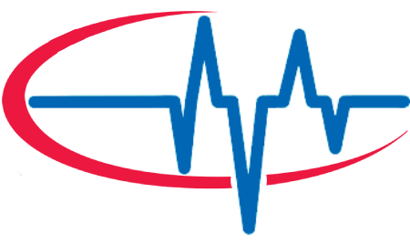

# Story:
DISCLAIMER: This application is used for demonstrative and illustrative purposes only and does not constitute an offering that has gone through regulatory review. It is not intended to serve as a medical application. There is no representation as to the accuracy of the output of this application and it is presented without warranty.

# Introduction:
Our heart beats 115200 times a day, it is such a fine machine that does not stop during our lives. However, not many people have the advantage to have this machine in good conditions. Many factors of daily life can permanently affect cardiac function.

Factors such as:

- Sedentarism.
- Diet full of Salt, saturated fats and refined sugar.
- Alcoholic intake.
- Smoking.
- High blood pressure.
- Obesity.
- Family history of heart disease.
- History of a previous heart attack.
- Age over 45 for men, or over 55 for women.
- Male gender (there's a direct correlation for cardiovascular disease).
- Substance abuse.
- Low potassium or magnesium.

## First Problem:

Quite a lot of people have to undergo cardiac tests frequently in expensive hospitals with gigantic measuring devices. We are in a time where open health is stronger than ever and it is time to make the patient the point of care.

The market for electrocardiography is quite enormous, as it has become the standard for patients with heart risks.


What we can see in this graphic is that most of the electrocardiographs are those big machines (as a Biomedical Engineer I can attest that most, are quite old). In addition to this most in the "holter" category are not really wearables but smaller ones that can be carried despite that a wearable one that can be used at home could provide invaluable information about the patient's heart.

One thing that we have to notice first. The first of wearables has already come out in the market and the results are not that great. The main issue that Doctors put forth is that it is too much information, think of the internet before data aggregators, it has no value if it cannot be interpreted correctly and that is something that has to be taken into consideration. A solution should aggregate all that data and provide carers with useful information.

Because of these reasons through AzureSphere's technology we will create a real-time heart rate, EKG monitoring system and a dashboard deployment, that will be out of the box secure, from the MCU, to the OS, to the cloud. Healthcare data is our most valuable one, and it is evident that this kind of security must become the norm in every device.

## Second Problem:
This brings us to the second problem that is quite basic, most EKG machines whether they are Holter's or Rest EKGs use gel-based electrodes. These are completely unusable in an athletic environment i.e. Athletes trying to measure themselves during activity. For these reasons we will try while developing the IoT device, to develop at the same time Dry electrodes.


## Materials:

Hardware:

- PSoC 6 AI Evaluation Kit - x1.

    https://www.infineon.com/cms/en/product/evaluation-boards/cy8ckit-062s2-ai/

- AD8232 - x1.

    https://www.amazon.com/AD8232-Sensor-Module-DIY-Arduino/dp/B0DRJJM9GF

- 3.7V 500mAh LiPo Battery - x1.

    https://www.amazon.com/Qimoo-Battery-Rechargeable-Connector-Electronic/dp/B0CNLNN1VP

Software:
- [DEEPCRAFT](https://www.infineon.com/cms/en/design-support/software/deepcraft-edge-ai-solutions/)
- [ModusToolbox](https://www.infineon.com/cms/en/design-support/tools/sdk/modustoolbox-software/)

## Connection Diagram:

This is the connection diagram of the system.

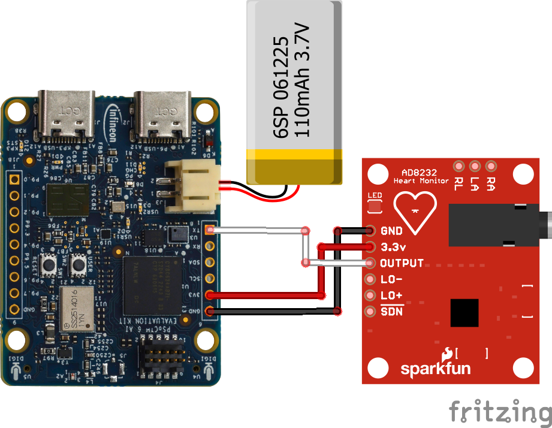

Todas las conexiones en la board y mayormente las de EKG son muy sensibles a cambios, por lo tanto el uso de cables en la board puede ser problematico, asi que se realizo una board soldada para evitar estos problemas.

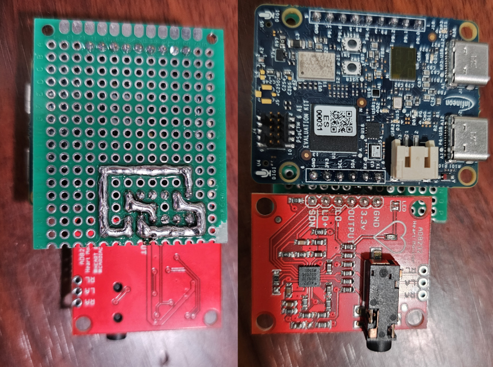

### Dry Electrodes:

This is perhaps the greatest development done in the project!

Due to the fact that this is a device that we are going to be using for long periods of time and it is also a device that must be used every day, we soon understood that the use of disposable electrodes is not feasible. So that's why we decided to make our own dry electrodes.

Materials:

- Copper Plate.
- Silver Conductive Ink.
- Electrode External Snap.


## Read the ADC:

Before starting all the work of collecting data to create an AI model, the first thing we did was write the code needed to read the ADC on our board. Luckily for us, one of the board's TX pins also allows us to read the ADC, P10_0 in this case.

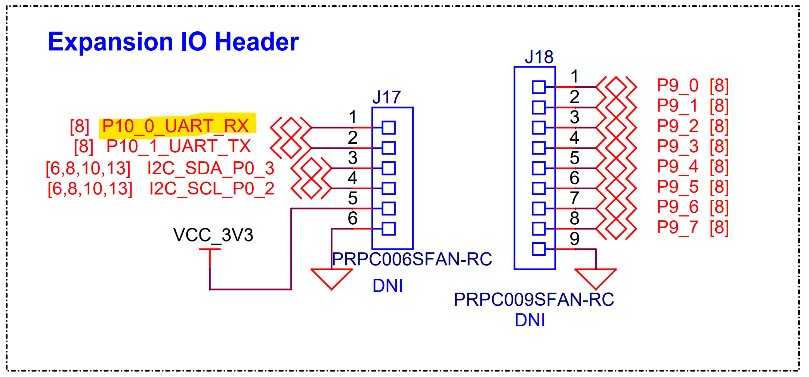

- This code is the basic ADC that Infineon provides in the examples; however, there are some important functions we'll use to obtain these values ​​in Studio.

    ```c
    void adc_single_channel_init(void); // Start the ADC on the board
    void adc_single_channel_process(void); // Read the ADC values
    ```

Here is the functional example to perform an ADC reading on the board.

[ADC EXAMPLE](./ADC_basic/main.c)

## Deepcraft Streaming:

The process of reading ADC data into Studio was laborious since the documentation for creating new sensors on the board and accessing them in the Studio is not entirely clear. However, a hack was performed on the Deecraft Streaming sample project to be able to read data from our EKG into Studio.

NOTE: This is a hack that needs to be refined for future versions of the documentation; however, it is fully functional.

- First, in the dev_bmm350.c file in the EKG_STREAMING project, the dependencies, functions, and definitions necessary for the ADC to work were added. Specifically, you must add the two functions mentioned above.

    ```c
    void adc_single_channel_init(void); // Start the ADC on the board
    void adc_single_channel_process(void); // Read the ADC values
    ```

- In the _init_hw function, you must initialize the ADC as shown in the following snippet.

```c
static bool _init_hw(dev_bmm350_t *dev, cyhal_i2c_t* i2c)
{
adc_single_channel_init();
cyhal_adc_configure(&adc_obj, &adc_config);
...
```
- Modify the _read_hw function so that all data read from the ADC is passed to Deepcraft Studio.

```c
static bool _read_hw(dev_bmm350_t* dev)
{
...
int32_t adc_result_0 = 0;
adc_result_0 = cyhal_adc_read_uv(&adc_chan_0_obj) / MICRO_TO_MILLI_CONV_RATIO;
float res = (float)adc_result_0;
data.y = res;

float *dest = dev->data + dev->frames_sampled * AXIS_COUNT;
*dest++ = res;
...
```
- The last major change is to change the names and labels the studio receives to be consistent with the sensor.

```c
int device = protocol_add_device(
protocol,
protocol_DeviceType_DEVICE_TYPE_SENSOR,
"ECG",
"ECG (AD8232)",
manager);
...
```

Finally, we'll complete the build, and in our studio, we'll be able to view the EKG sensor data, as well as change its sampling rate, etc.
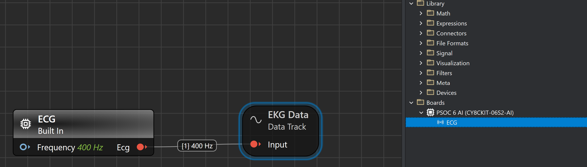

Los datos que deberemos ver en el estudio deberan ser los siguientes. Recomendamos tomar ventaja del studio y colocar un Low Pass filter, ya que al ser una señal muy pequeña la del EKG puede visualizarse la señarl de 50-60hz de la linea electrica.

### Without Filter at 400hz:

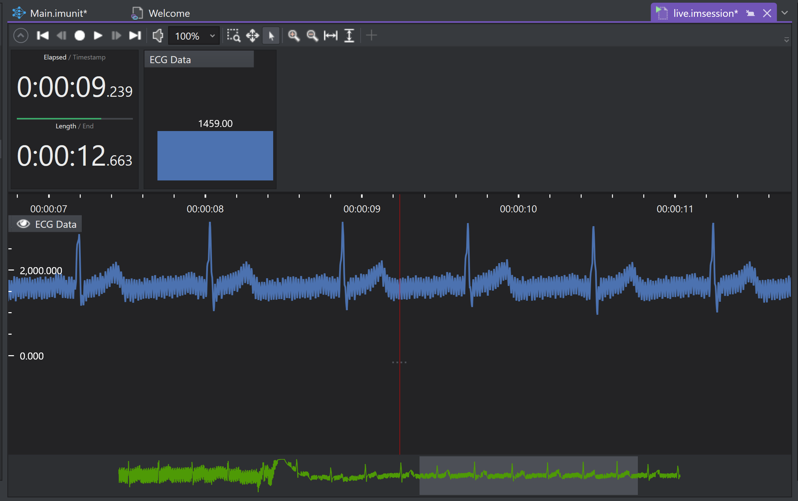

### With Low Pass Filter at 400hz and alpha 0.2

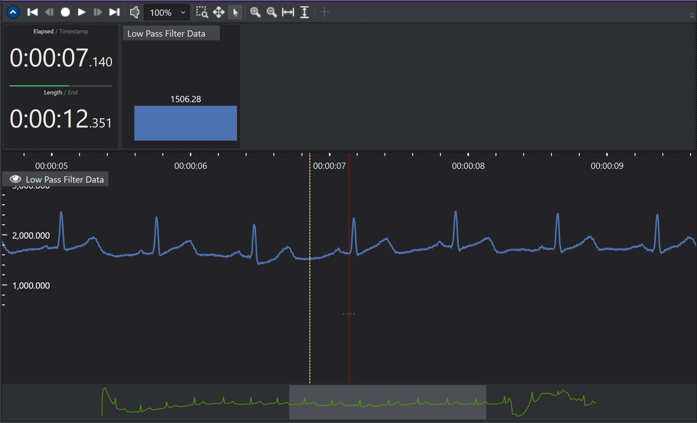

Recomendamos ampliamente revsiar todas las modificaciones realizadas en el proyecto de Modus.

[EKG Modus](./EKG_STREAMING/source/main.c)

## Deepcraft Data:

Ahora que recibimos los datos de el EKG correctamente y podemos verlo en el studio, es la hora de obtener algunas sesiones, estas solo pueden durar maximo 5 min, sin embargo te recomiendo realizar las mas posibles para obtener una buena cantidad de datos.

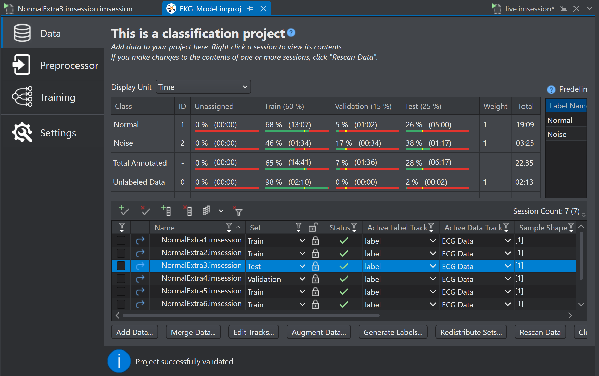

Consideraciones:
- Los datos en el studio no pueden dividirse, osea que las sesiones completas deben de ser asignadas a un tipo de set, train, test y validation.
- Trata de que todas las sesiones tengan la mayor cantidad de labels posibles ya que Deecraft studio lo utilizara para el entranamiento.

Si quieres ver las sesiones que generamos para este modelo son las siguientes.

[SESSIONS](./EKG_DATA/)

## Deepcraft Model:

El programa nos provee una buena herramienta para desarrollar modelos de forma agil para nuestros datos.

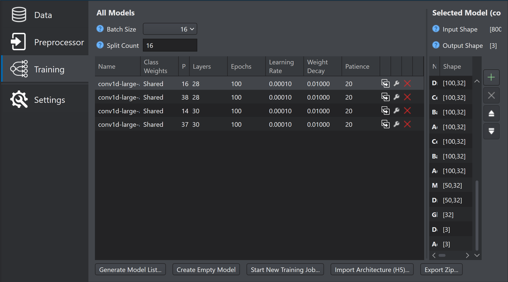

En nuestro caso te compartimos los resultados de el entrenamiento de nuestro modelo con el fin de que puedas realizar tus propias pruebas y encontrar uno mejor.

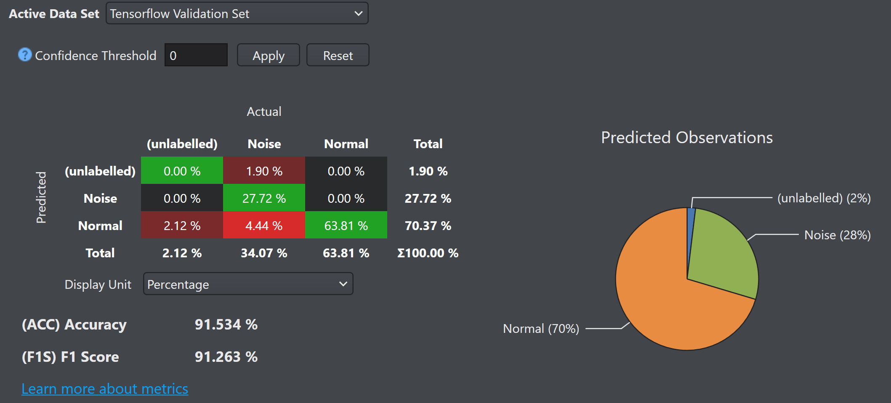

El modelo que utilizamos en nuestro proyecto fue el siguiente, puedes descargarlo y probarlo directamente en Deepcraft studio.

[MODEL](./EKG_MODEL/Models/conv1d-large-accuracy-2/conv1d-large-accuracy-2.h5)

## Deepcraft Deployment:

Ahora ya con un modelo funcional, debemos de desplegarlo en nuestro PSoC 6 AI, lo unico que tendremos que hacer es ir a la pestaña de CodeGen y generar el codigo del modelo en C.

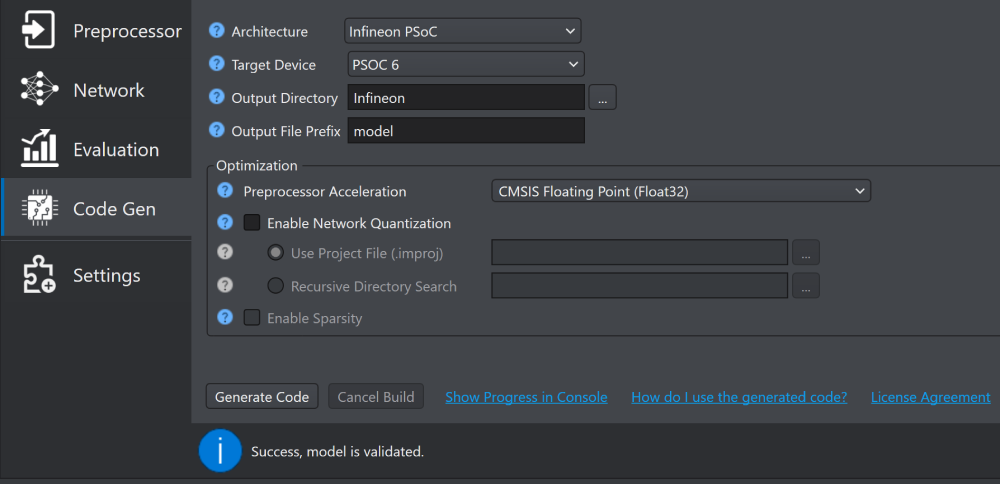

Una vez generado el modelo obtendras dos archivos, model.c y model.h. Estos dos archivos deberas colocarlos en tu codigo de Modus para empezar a realizar inferencias.

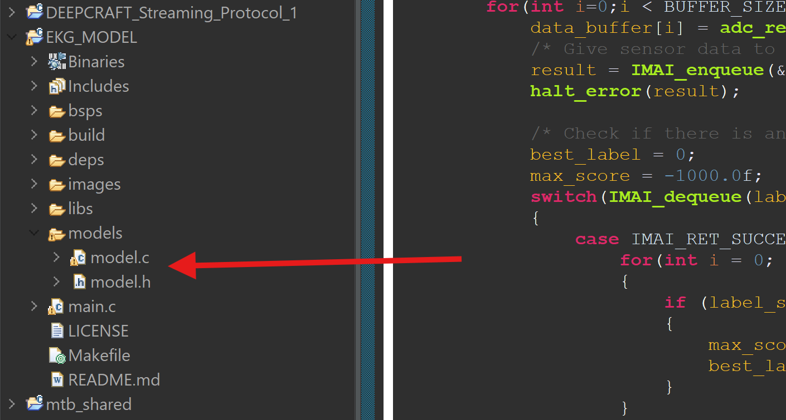

NOTA: No hay un ejemplo basico de como realizar inferencias de sensores leidos mediante ADC, sin embargo realice mi propio codigo basandome en los ejemplos provistos por Infineon.

[ADC MODEL INFERENCE](./EKG_MODEL_MODUS/)

## The Final Product:

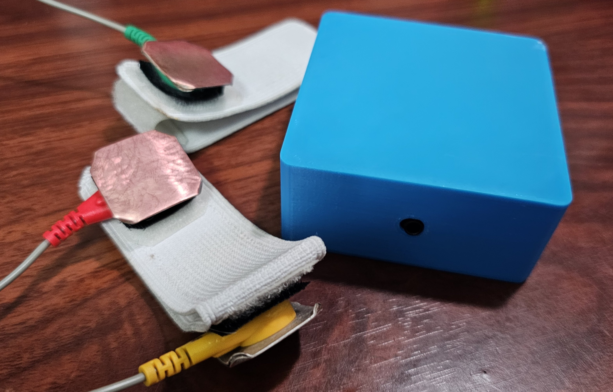 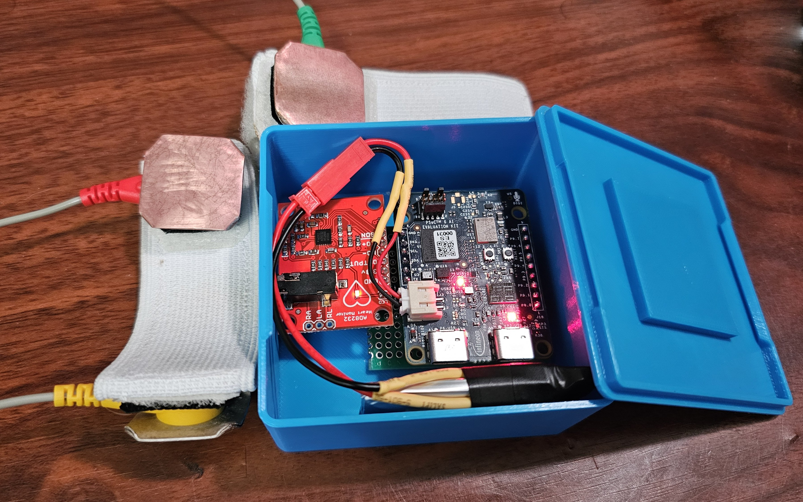

## Our Epic DEMO:

Video: Click on the image
[](https://youtu.be/qot2t_1B3OY)

Sorry github does not allow embed videos.

## Future Rollout:

We think we have achieved a great medical device prototype with this project. It does everything an IoT-capable device should do and probably we have solved some of the problems in relation with gel-based electrodes. And that is perhaps the main innovation with this device. It has huge market potential mainly with sports science applications. For our next steps in relation with this project we will focus on testing it in both sports and clinical applications and also on the market of sport-related or exercise related classes and services, which also show great potential.
